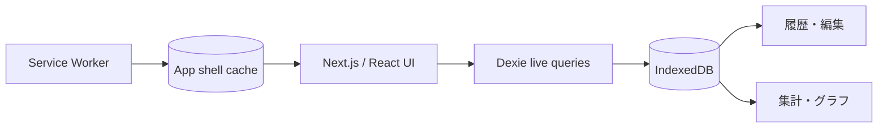

# LiftLog

スマートフォンで素早くトレーニングを記録し、履歴・負荷・最高重量・筋肉部位の偏りを確認できるローカルファーストPWAです。

**公開デモ:** https://yukiyoshi-eng.github.io/weight-training-app/

## 主な機能

- 重量・回数・RPE・時間のセット記録
- 入力途中セッションの自動復元
- 前回セットの参照・一括コピー
- 過去セッションとセットの編集・削除
- カレンダー形式の履歴
- 30日・90日・全期間の分析
- 総負荷、最高重量、セッション数、ストリーク
- 正面・背面の筋肉分布
- カスタム種目、お気に入り、検索
- JSONバックアップの出力・復元
- PWAインストールとオフライン利用

## 設計



トレーニングデータは外部サーバーへ送信せず、利用端末のIndexedDBに保存します。Service Workerが画面と静的アセットをキャッシュするため、一度読み込んだ後は通信できない環境でも記録・閲覧できます。バックアップファイルを使って手動で移行できます。

## 技術スタック

- Next.js 16 / React 19 / TypeScript
- Dexie.js / IndexedDB
- Recharts
- Vitest / ESLint
- GitHub Actions / GitHub Pages
- Web App Manifest / Service Worker

## ローカル実行

```bash
npm ci
npm run dev
```

`http://localhost:3000` を開きます。

## 品質チェック

```bash
npm run lint
npm test
npm run build
npm audit
```

分析ロジックは、種目別負荷、期間抽出、ストリーク、サマリー集計を自動テストしています。`master`へのpush時には、GitHub ActionsがLint・テスト・静的ビルドを実行し、成功した成果物だけをGitHub Pagesへ公開します。

## プライバシー

- アカウント登録なし
- 外部APIへの記録送信なし
- 位置情報・ヘルスケアデータへのアクセスなし
- データ削除は端末内だけで完結

端末やブラウザのデータを削除すると記録も消えるため、必要に応じて設定画面からバックアップを保存してください。
